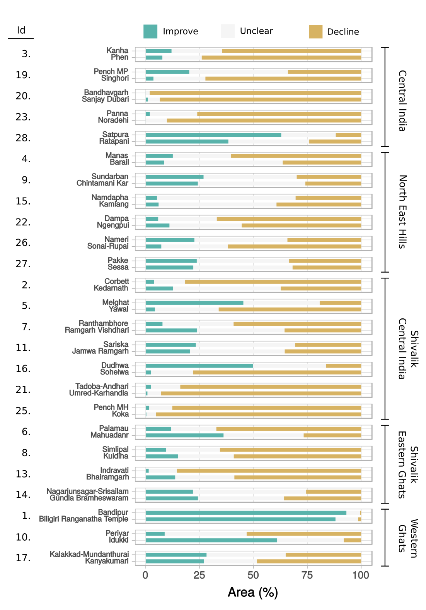

## Description
A project involving comparison of vegetation condition in India's [Tiger Reserves](http://wiienvis.nic.in/Database/trd_8222.aspx) and [Wildlife Sanctuaries](http://wiienvis.nic.in/Database/wls_8230.aspx).

Vegetation condition was analysed and summarized using historical Landsat 5 TM imagery on [Google Earth Engine](https://earthengine.google.com/). Results were visualized using R code here.

* **Visualization of results**: [An earth engine app](https://pradeepkoulgi.users.earthengine.app/view/india-tr-condition)
* **Publication**: Koulgi, P.S., Clinton, N. & Karanth, K.K. Extensive vegetation browning and drying in forests of India’s Tiger Reserves. Sci Rep 9, 14976 (2019). [DOI: 10.1038/s41598-019-51118-8](https://doi.org/10.1038/s41598-019-51118-8)
* **Results and code**: [DOI: 10.17632/6jhr4xfs3x.1](https://dx.doi.org/10.17632/6jhr4xfs3x.1)

## Results and Methods
Figures were generated using R code in [visualizeEEResults.R](https://github.com/pskoulgi/parksEvalEEInterpret/blob/master/visualizeEEResults.R), maps were made in QGIS, and/or finished in Inkscape.

### After Tiger Reserve Declaration
         |  
:-------------------------:|:-------------------------:

### Change from before to after Tiger Reserve Declaration
      |  
:-------------------------:|:-------------------------:

### Condition maps

:-------------------------:

### Method

:-------------------------:

### Study area

:-------------------------:
